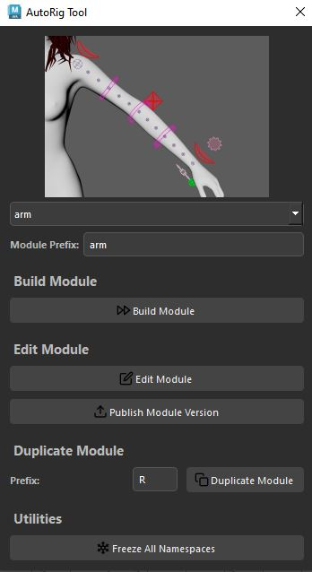

# AutoRig Tool for Maya

A modular, UI-driven autorigging system for Autodesk Maya 2025+.

Designed for technical artists and riggers, this tool provides a clean and extensible interface to:
- Build and edit rig modules
- Publish versioned rig modules
- Duplicate modules under new namespaces
- Freeze and clean up namespaces

---

## 🚀 Quick Start

### 🧩 Option 1: Script Editor
```python
import fnkRigTool.main as rig_main
rig_main.launch_autorig_tool()
```

### 🧩 Option 2: Shelf Button
Assign this to a custom shelf:
```python
import fnkRigTool.main as rig_main
rig_main.launch_autorig_tool()
```

### 🧩 Option 3: `main.py`
To run directly from the file:
```python
import main
main.launch_autorig_tool()
```

---

## 🔌 Maya Integration (.mod File)

To auto-load the tool as a module:

1. Place `fnkRigTool` folder in:
   ```
   C:/Users/<username>/Documents/maya/modules/fnkRigTool/
   ```

2. Create a `.mod` file inside that folder:

   ```ini
   + fnkRigTool 1.0 C:/Users/<username>/Documents/maya/modules/fnkRigTool
   PYTHONPATH+:=fnkRigTool
   ```

3. Restart Maya → You can now import it via:
   ```python
   import fnkRigTool.main as rig_main
   rig_main.launch_autorig_tool()
   ```

---

## ✨ Features

- ✅ Visual module browser with image previews
- ✅ Build modules using .ma version files
- ✅ Edit and rebuild guides on-the-fly
- ✅ Duplicate modules with preserved inputs
- ✅ Publish `.ma` versions with auto-increment
- ✅ Freeze and flatten namespaces for export
- ✅ Styled PySide6 UI with icons, tooltips, and grouping

---

## 🖼 UI Preview
 


---

## 🛠 Dependencies

- Maya 2025+  
- Python 3.10+ (as used in Maya 2025)  
- PySide6 (comes with Maya 2025)
- Frankenstein Tool (from https://github.com/BaratteG/ for the rig modules logic)

---

## 👨‍💻 Development Notes

### To reload and test in Maya:
Use `testInMaya.py` which:
- Adds your workspace path
- Reloads all UI + logic modules
- Launches the UI

```python
import testInMaya
```

---

## 📄 License

MIT License

---

## 📬 Contact

Developed by **Julien Miternique**  
Special thanks to **Emilien Blancquaert** for his participation to the fabrication of the various Rig Modules and to my teacher **Guillaume Baratte** for his Frankenstein Tool logic and inspiring me to develop this tool.
For support, bug reports or contributions, please contact: julienmiternique.pro@gmail.com